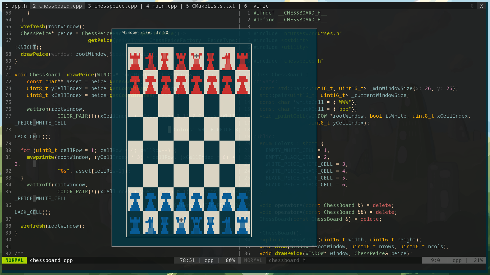

# ch355

Terminal based ch355 game.

<p align="center">
    </img>
    </img>
</p>

## Setup

The game and code is made to run natively on the GNU/Linux and MacOs.

### Requirements

* C++11 compiler (e.g. `g++`, `clang++`, `pgc++`, `icpc`, etc.)
* Virtually any platform including:
  * Linux
  * MacOS
* [CMake](https://cmake.org/) 

### Installation

1. Open your terminal in your preferred directory and clone this project:
```sh
git clone --recurse-submodules https://github.com/hemanshu-dev/ch355.git
```
2. Enter the project directory:
```sh
cd ch355
```
3. Build the executable .
```sh
mkdir -p build
cd build
cmake ..
cmake --build .
```
4. Run the program and play the game! :tada:
```sh
./ch355
```
---
